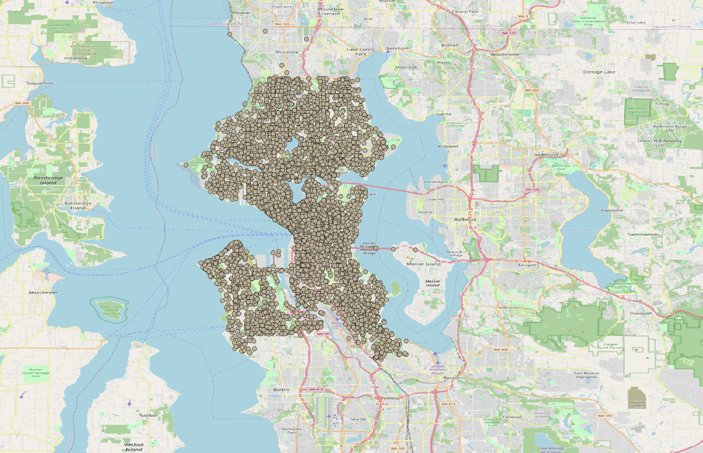
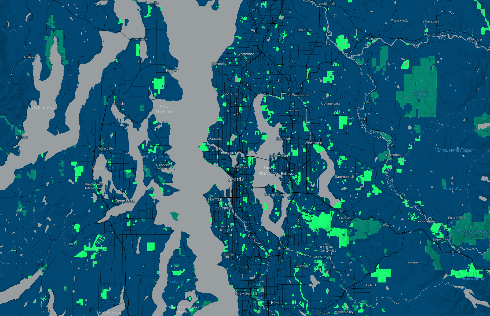

# Lab 4 - Making Tile Maps

[Link to Web Page](https://jduffy8.github.io/tile_maps/)

With my maps, I have examined the greater Seattle area, with a focus on the UW area and the area surrounding Lake Washington. With this map, I wanted to examine the relationship between the green spaces around Seattle and the ratio of 911 service calls made in an area. My map, with a minimum zoom of 3 and a maximum zoom of 14, allows for this to be done with ease, by including both maps with easy to distinguish features.

The first map is my basemap. I went with a gray monochrome because it felt easy on the eyes while still being very informative. This map establishes a strong base to build off of.

The second map is a map of 911 calls in Seattle over the course of 2024. These calls are very accurately located, so zooming in will making this much more informative for the consumer. 

The third map is my basemap with the 911 calls overlaid on this map. This allows for another view, with a greater focus on the 911 calls over a more simplistic base map.

My final map is a map highlighting the greenspaces in Seattle. By making these bright green, I have tried to emphasize them as smuch as possible, while trying to minimize the other aspects of the map. This creates a visual hierarchy with a strong focus on the greenspace.